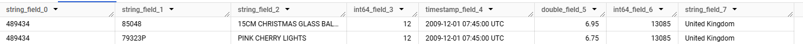

Marketing Coding Project

Created By Brandon Leon

Purpose - To demonstrate how SQL can be used to update tables, filter data, and create reporting views to provide critical insights for an online marketing team in a Google Big Query environment.

	Query 1 | Fixing the Schema
 
Link: [queries/query1.sql](https://github.com/leonbrandon0021/retail_marketing_project/blob/main/queries/query1_updating_field_names.sql)

Problem - Often, data imports can be messy. A typical issue occurs when a csv file incorrectly parses out the field (column) names and a data engineer will need to rename the fields

 

Expected Result

	Query 2 | Creating Primary and Foreign Keys

 Problem - The table did not have any primary or foreign keys set up when it was created. It is important to establish these relationships between tables and define the uniqueness of certain fields.

*Unfortunately, GBQ does not allow for enforcement of uniqueness after a table was created

**Customer Table does not exist in my GBQ dataset. Which is why no foreign key was created. Query is used to show how that key would be created if said table did exist

Expected Result

